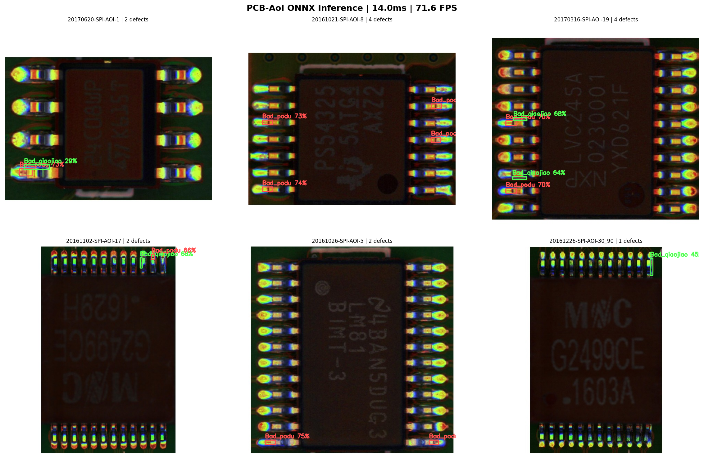

# PCB Automated Optical Inspection (AOI)

Real-time PCB solder defect detection using YOLOv8 + ONNX.  
Trained on the [PCB-AoI industrial dataset](https://www.kaggle.com/datasets/kubeedgeianvs/pcb-aoi) — real SPI/AOI thermal imagery.



## Results

| Metric | Value |
|--------|-------|
| mAP@50 | **90.4%** |
| Inference Latency | **14ms** |
| Throughput | **71.6 FPS** |
| Bad_podu mAP | 92.6% |
| Bad_qiaojiao mAP | 88.2% |

## Business Value

- Inspects **71 boards/second** — no human inspector matches this
- Catches **87 of 100 defects** before they leave the line
- **90% precision** — 1 in 10 alerts is a false alarm
- **Edge deployment** — runs on-site, no cloud, no subscription

## Quick Start

```bash
git clone https://github.com/YOUR_USERNAME/pcb-aoi-inspection
cd pcb-aoi-inspection
pip install -r requirements.txt

# Run inference
python inference/inference_onnx.py \
    --model models/pcb_defect.onnx \
    --source path/to/pcb_image.jpg
```

## 🐳 Docker Deployment (Full Stack)

Run the complete pipeline with one command:

```bash
cd docker
docker-compose up
```

This starts:
| Service | URL | Credentials |
|---------|-----|-------------|
| InfluxDB | http://localhost:8086 | admin / admin123456 |
| Grafana Dashboard | http://localhost:3001 | admin / admin |
| Inspector | — | auto-starts |

Then run the publisher in a separate terminal:
```bash
python mqtt/mqtt_publisher_real.py
```

### Docker Stack
```
YOLOv8s ONNX → MQTT → Inspector Container → InfluxDB → Grafana
```

## Dataset

Download from Kaggle and convert:
```bash
python data/convert_voc_to_yolo.py
```

## Training

```bash
python train/train.py
```

## Tech Stack

- **Model**: YOLOv8s (11M parameters)
- **Format**: ONNX — runs without PyTorch
- **Dataset**: PCB-AoI (SPI/AOI thermal imaging)
- **Defects**: Bad_podu آ· Bad_qiaojiao


## Download Models

Models are hosted on Google Drive (too large for GitHub):

| File | Size | Link |
|------|------|------|
| pcb_defect.onnx | 42 MB | [Download](https://drive.google.com/file/d/1Cb8w8IR7dQu7U9F3rQ19XSr61TG9ArJ_/view?usp=drivesdk) |
| pcb_defect.pt   | 22 MB | [Download](https://drive.google.com/file/d/1Cc2CDgqP-IQQHdFJnC1bCjStQlgE1iQn/view?usp=drivesdk) |

> ONNX model runs without PyTorch — deploy anywhere.

## License
MIT
